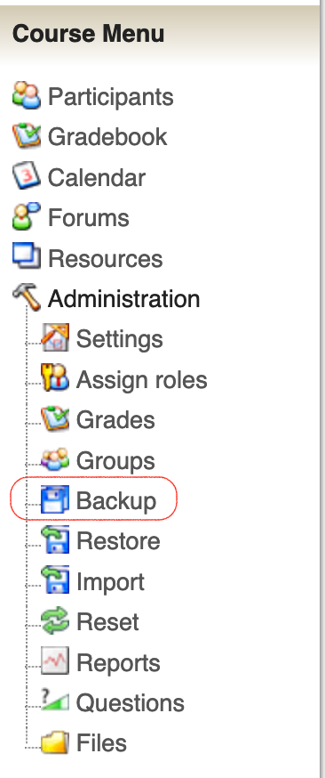
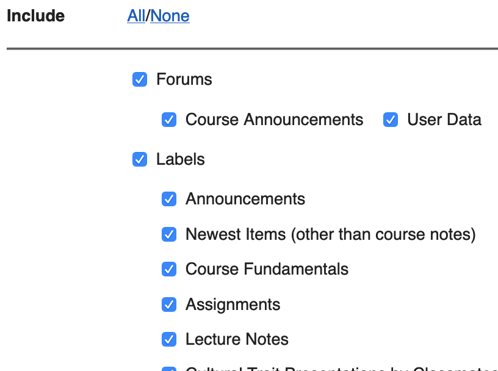
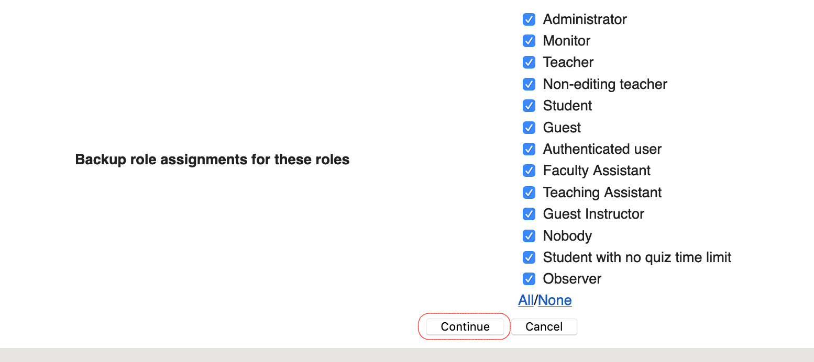
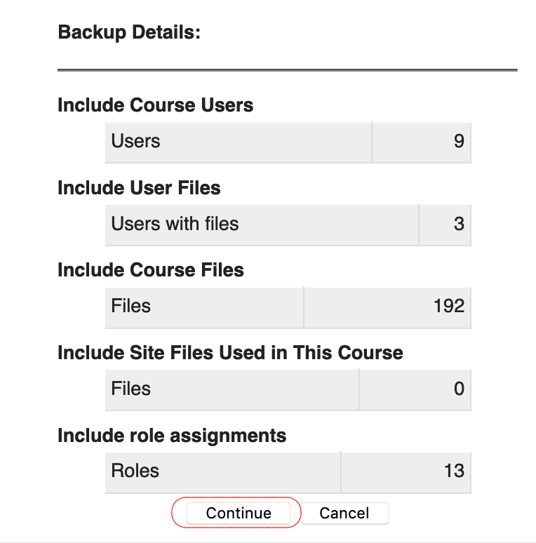
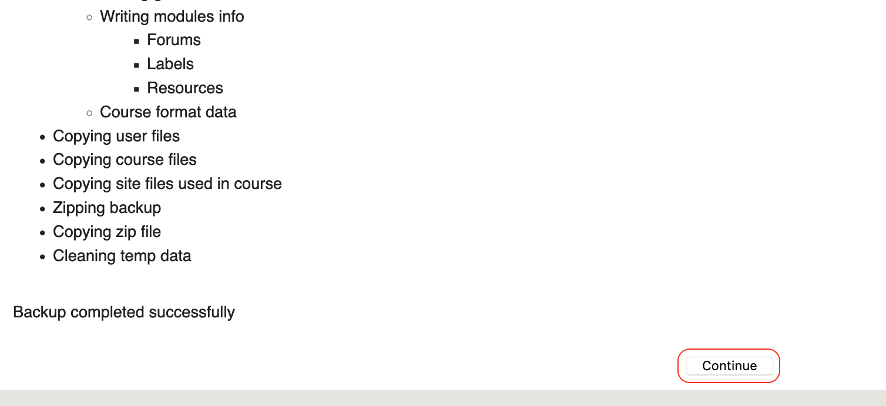
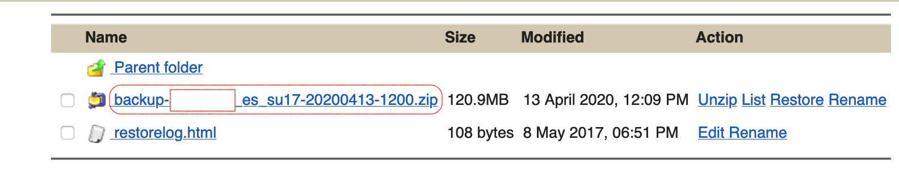

!! Please be advised that MyCourses, the previous TWU learning management system, will be closed on June 15, 2020.

## Students

If you have course materials from past courses, you may sign in as below and download your *OWN* assignments or copy and paste your own forum responses.

!! Faculty-created materials (course notes, PowerPoint decks, commentary, videos, quizzes, etc.) are protected by copyright and may *NOT* be downloaded.

## Faculty and Staff

If you have content in MyCourses that you think you may need to access in the future, you may create and download a backup of your course site.

##### Sign in to MyCourses
- go to [courses.mytwu.ca/my](https://courses.mytwu.ca/my) and sign in with your TWU Pass credentials.

##### Navigate to your course

##### Click 'Backup' in the Course Menu

##### Select Content
- Use the checkboxes to choose which content to include in your backup.

##### Click 'Continue'
- Scroll to the bottom of the page and click 'Continue'

##### Click 'Continue' again
- Scroll to the bottom of the next page and click 'Continue' again.

##### Click (you guessed it) 'Continue' yet again.

! The backup process may take some time depending on the size of your course. There will be a message at the bottom of the page that says 'Backup completed successfully'.

##### Download your backup file
- On the next screen you will see a list of all of the backups you have created for that course.
- click the title of the course to download the file to your computer.

- Store your backup in a folder on TWU OneDrive for safety and security.
