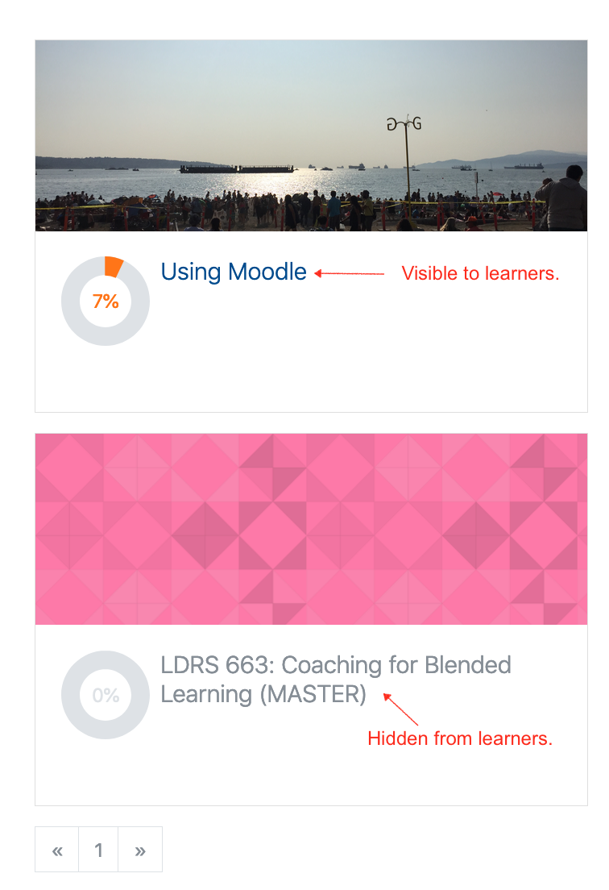

##### Basic Moodle Preparation
There are also some things you can do ahead of any significant disruption to ensure that your learners know where to access course materials. The easiest way to manage this is to use the Moodle site that is automatically provisioned for every for-credit course offered in every semester at TWU. Keep in mind that you do not need to worry about designing a fully online course. All you need to do is to create a repository where you can communicate with learners and exchange files.

Here are some simple tasks to help you set up a basic Moodle site.

- [Accessing Moodle](https://create.twu.ca/help/moodle/basics/introduction)
- [Make your course visible to learners](https://create.twu.ca/help/moodle/faculty/show-hide)
  - All courses are hidden from learner view when they are first created. This gives you as faculty control over when to make it visible. You must follow the very simple instructions above before learners will be able to see your course.
  - If a link to a course is grey in your dashboard, it is hidden.
  - 
- [Create a welcome forum](https://create.twu.ca/help/moodle/faculty/activity-or-resource/creating-a-forum)
- [Uploading files (syllabi, sample documents, etc) to Moodle](http://create.twu.ca/help/moodle/faculty/activity-or-resource/adding-resources)

##### Yes, email is a reasonable tool!
For some of you, it might be enough to upload a PDF or MS Word file with your syllabus and then manage communication and file exchange with your learners via email. There is a very long history of online learning using email. It actually extends far beyond that, though; distance learning and remote learning principles are evident in the New Testament epistles.

You can access student emails directly in Moodle by licking [I'm keeping the typo. Please don't lick your computer. ~cm] the 'Participants' link in the menu on the left side of the page. If you have a large class, you can also [export your gradebook to MS Excel](https://create.twu.ca/help/moodle/faculty/grade-book/download-gradebook), and column F should be all the learner emails in your course. From there, you can copy and paste into an email 'To:' field.

##### Using Moodle to connect learners with Library resources
The TWU Library is accessible online, and there is a tool integrated in Moodle to allow you to create a share reading lists.

- [Creating reading lists using EBSCO Curriculum Builder](http://create.twu.ca/help/moodle/faculty/activity-or-resource/ebsco-curriculum-builder)

While you can technically upload PDF articles to Moodle, creating a reading list through the EBSCO Curriculum Builder ensures that your learners, especially those who require screen readers or other accommodations, are able to access resources in formats that make sense for them.

##### Using Moodle to manage assignments

The assignment tool in Moodle is very robust and allows for a completely digital workflow. You can create assignment dropboxes in Moodle that will allow you to communicate the details of the assignment to students, set due dates (optional, please consider that your learners lives have been significantly disrupted and due dates may be better framed as 'suggested targets'), gather assignment files as MS Word, PDF, Excel, or other filetypes.

- [Creating Assignment Dropboxes in Moodle](http://create.twu.ca/help/moodle/faculty/activity-or-resource/creating-an-assignment-dropbox)
- [Grading assignments in Moodle](https://create.twu.ca/help/moodle/faculty/grade-book/grade-assignment)
