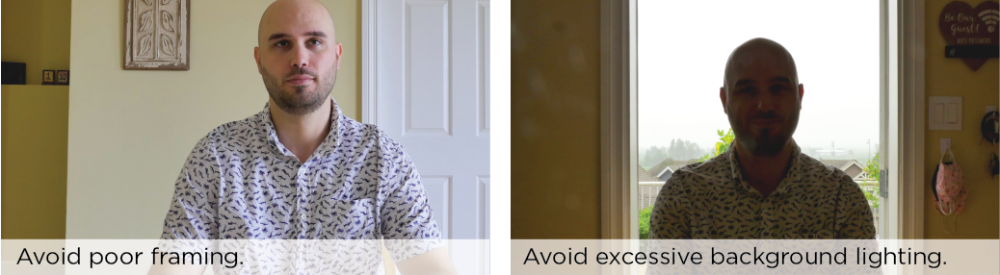

As video conferencing, and online classes are becoming more the norm,  you might be considering how to improve your on-screen presence. If so, this guide is for you. For sorting through the techy side of video conferencing and filming, as well as gear recommendations, please see [Sorting Through Your Techy Video Issues.](https://create.twu.ca/help/online-learning-on-ramp/quick-start-guides/video)

#### Looking Professional

Do you want to look more professional on your next Zoom meeting or video presentation? Let’s start with the camera. A neutral camera position and good framing will feel most natural to anyone watching you on a screen.

Start by positioning the camera (or webcam) at the same height as your eyes. Position yourself in the centre of the frame and leave a little space between the top of your head and the top of the frame. If you can, try and avoid poor framing. If your head is touching the top of the frame, it's too close!

 If you have lights, set them up ensuring that you have enough light directed at your face (and not too much light hitting your camera).
If light from either a window or other large light source is brighter behind you than in front of you, you risk being covered in shadows! Please avoid being covered in shadows.

 Find out how you can [take advantage of natural light when on camera!](https://www.youtube.com/watch?v=j7Rf6u-XveM)

#### Sounding Good

Whenever possible, do not use your  built-in microphone. Try and position your external microphone no further than 6 inches away from your mouth, and far away from any environmental noises (such as a computer). For a more in-depth look at mic positioning [watch this.](https://www.youtube.com/watch?v=Y-D_Lh1W-98)

#### Feeling Good

Let’s talk about you. The whole transition to learning online has left a lot of us feeling a little odd. It can be a startling transition to suddenly be talking to a camera instead of a person. Fortunately there are a few things that you can do to increase your comfort level. Take a moment and watch this short video for some great tips on  [getting comfortable on camera.](https://www.youtube.com/watch?v=ymyVwx4xNNQ)

We hope you've found these tips useful as you adapt the changes in your academic experience. Should you have any questions, please contact [elearning@twu.ca](mailto:elearning@twu.ca).
