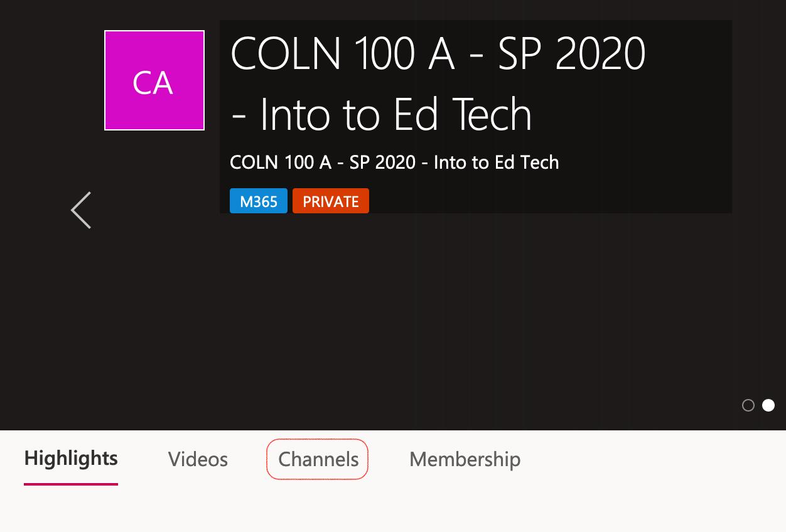
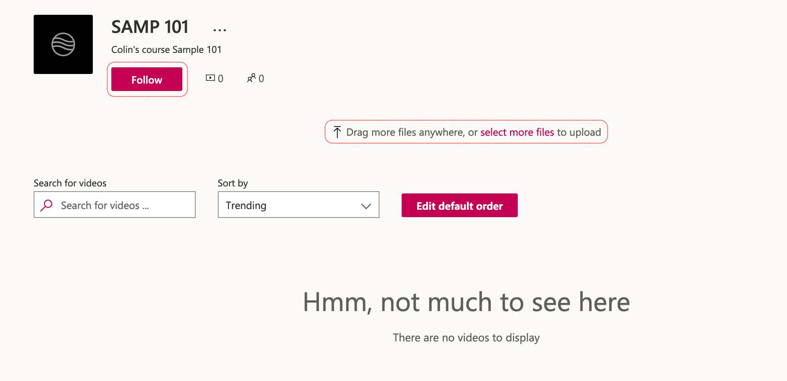

TWU has provided access to Microsoft Stream, which is like our very own YouTube, but accessible only to members of the TWU community.

### Accessing Stream

[Visit web.microsoftstream.com](https://web.microsoftstream.com) and sign in with your TWU Pass credentials, including your full TWU email address `firstname.lastname]@mytwu.ca`.

### Click 'My content', then 'Groups'.

### Click the title of your course group.

Your group is named according to the course you are taking.

### Click 'Channels' in the group.

### Upload Videos

- Either drag and drop files to the window, or click the link to navigate to your video file.

!!! Zoom recordings will be in .mp4 format.

### Add Video Details
- Name the video to make it easy for your classmates and instructor to find, including the date of the recording.
- Include a description or hashtags (optional)
- Choose a thumbnail (optional)
- Once the file has uploaded and has been processed, click 'Publish'.
- For now, don't change the permissions or options.

!!!! Videos that you upload to channels that are in a private group will only be accessible to members of that group.

### Subsequent Videos

The next time you need to upload a video, start by clicking 'My content', then 'Channels', select the appropriate channel, and repeat the upload process above.

### Manage your computer storage

**After you have confirmed that your video is in the proper channel *AND* you have tested that it plays**, you should move the original video file off of your computer and either onto an external drive (optional) or simply delete it.
