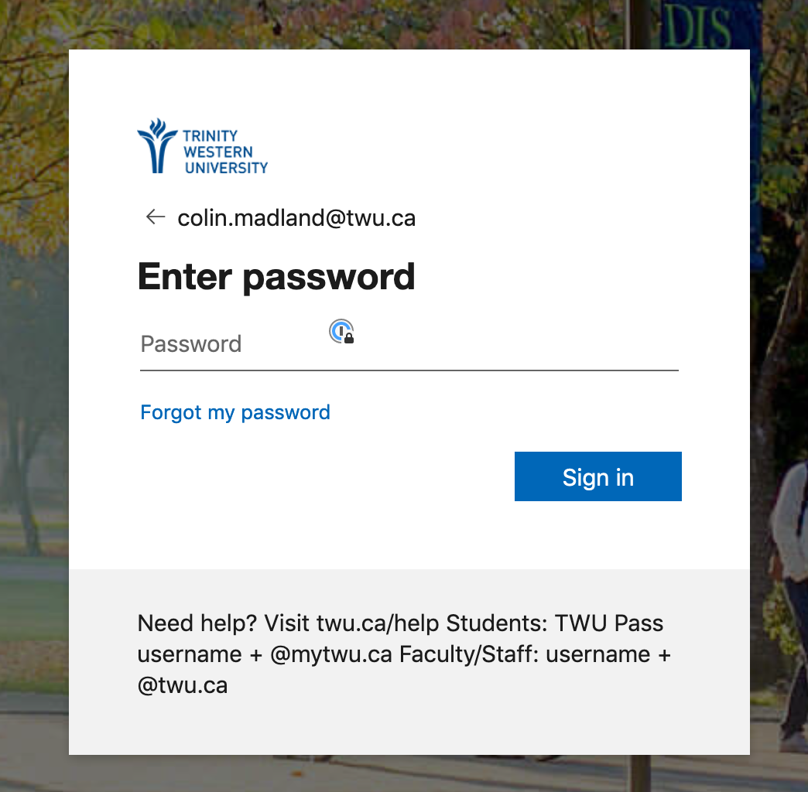
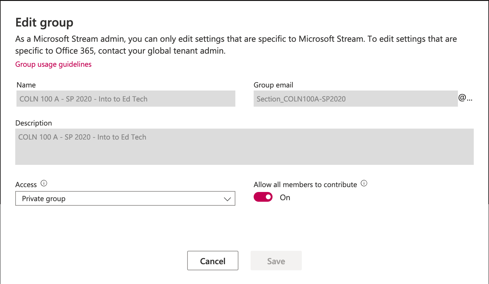
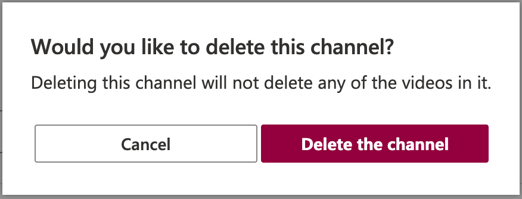
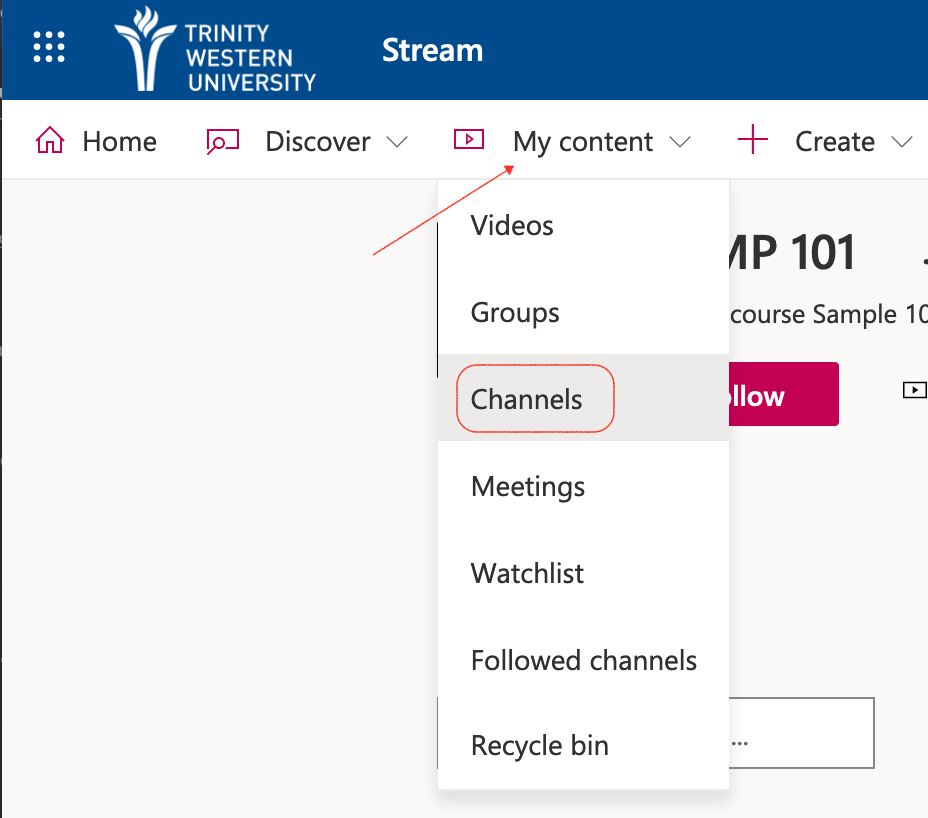

TWU has provided access to Microsoft Stream, which is like our very own YouTube, but accessible only to members of the TWU community.

!! When you record in Zoom, please record to your local computer, then upload to MS Stream.

### Accessing Stream

[Visit web.microsoftstream.com](https://web.microsoftstream.com) and sign in with your TWU Pass credentials, including your full TWU email address.

### Click 'My content', then 'Groups'.

! Groups allow all members of the group to upload to videos to the group, so if learners need to send you video (perhaps recordings of performances or presentations) they should use your class group to do so in order to protect their privacy.

### Click the title of the group.

Your group is named according to the course you are teaching.

### Click 'Channels' in the group, then 'Create a new channel'.

!!! If you have already created a channel in Stream, unfortunately, there isn't a way to edit your company wide channel to be a private channel. You will have to delete the original channel and follow the instructions below to create a new one connected to your group. Deleting the channel will ***NOT*** delete the videos within the channel, but it might change the privacy of the video.

! Click Membership to ensure your class list is accurate.

You can also click 'Create a channel' on the splash page.

### Enter the channel details.

- Give your channel a descriptive name, likely one that matches your course, and an optional description.
- Keep the channel access limited to your course group.
- Upload a picture of your cat
- Click 'Create'.

### Upload Videos

- Click the channel
- Either drag and drop files to the window, or click the link to navigate to your video file.

!!! Zoom recordings will be in .mp4 format.

### Add Video Details
- Name the video to make it easy for learners to find, including the date of the recording.
- Include a description or hashtags (optional)
- Choose a thumbnail (optional)
- Once the file has uploaded and has been processed, click 'Publish'.
- For now, don't change the permissions or options.

!!!! Videos that you upload to channels that are in a private group will only be accessible to members of that group.

### Subsequent Videos

The next time you need to upload a video, start by clicking 'My content', then 'Channels', select the appropriate channel, and repeat the upload process above.

### Manage your computer storage

**After you have confirmed that your video is in the proper channel *AND* you have tested that it plays**, you should move the original video file off of your computer and either onto an external drive (optional) or simply delete it.

[Click here to learn how to embed your channel in Moodle.](http://create.twu.ca/help/online-learning-on-ramp/running-a-session/conferencing/embed-in-moodle)
