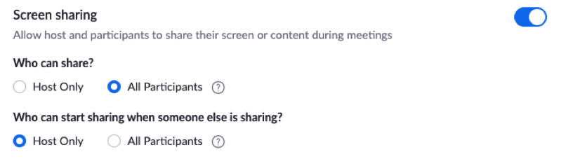
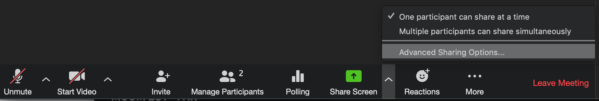
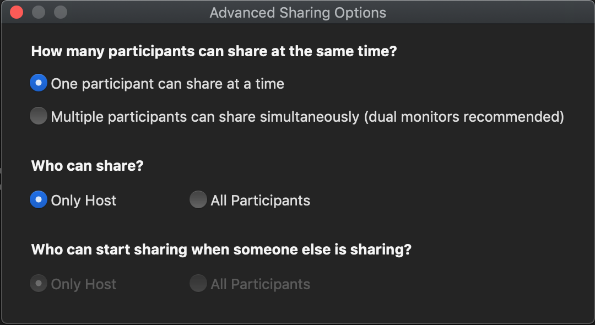
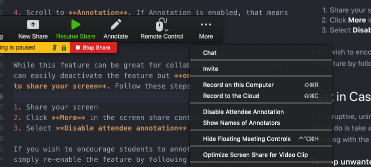
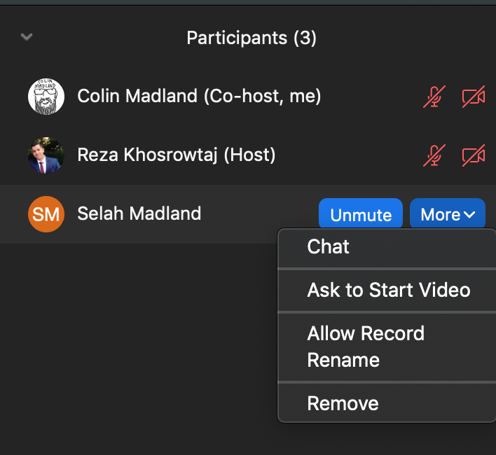
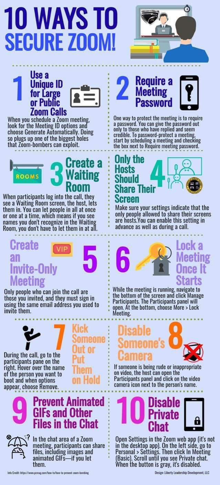

!!!! [4 Tips to Avoid Zoom Bombers](https://docs.google.com/document/d/1o16M200ruwHCA3iBqg72yKo3vjxXCblmNGZeV38smUs/edit) is by [Michelle Pacansky-Brock](https://twitter.com/brocansky) and is shared with a Creative-Commons-Attribution-4.0 License.

## **What is a Zoom Bomber?**

Zoom is a synchronous (live) web conferencing tool that is fantastic for fostering meaningful instructor-student and student-student interactions. It is being used by many faculty to assist them with a smooth transition to temporary remote teaching and learning.

However, in this time of disruption, there has been an increased likelihood that you may have uninvited attendees show up in your meetings and deliberately try to derail it. During the COVID-19 period, educators are reporting incidents of “Zoom-bombing” or “Zoom trolls.” The following six tips are provided to help you continue with your synchronous instruction in Zoom without the burden of uninvited attendees.

## If you use Zoom, you are encouraged to follow tips 1-3:

### Tip 1: This Too Shall Pass

Many educators have used synchronous tools like Zoom for years without experiencing this issue. Once our period of disruption has passed, you can loosen up the reigns on your meeting settings.

### Tip 2: Trust Your Students

This is a very stressful time for students too. While you should take precautions to ensure your Zoom meetings are attended only by your students, be careful that your students don’t interpret your actions as a sign of your distrust in them. Be open with them about what has been happening and let them know that you’ll be taking extra precautions to create a safe, welcoming environment for them.

### Tip 3: Share Links in Your Password-Protected Course

This tip should be all you need to do! Zoom-bombing happens when a meeting link has been shared publicly. Avoid posting your links in a public place like on a website or even sharing them in an email. There are ways to make that link easily available to your students, but not so easily available to other people.

You are strongly advised to share your link to the Zoom session in your password protected course (Moodle, Canvas, Blackboard, etc.) so it is only accessed by students enrolled in your class.

## **If you still feel uncertain and want to do more to secure your meetings, consider steps 4-6.**

### Tip 4: Adjust Screen Share Options in the Meeting

Most likely, your Zoom In-Meeting settings at the account level are set to allow all participants to share. Giving students the opportunity to share their work is a powerful feature of Zoom. It is best to leave this setting enabled at the account level and make fine-tuned adjustments within meetings when it is not appropriate for others to share.

Below is a screenshot of the Zoom meeting settings at the account level. To check your account settings, go to twu.zoom.us, sign in, choose Settings on the left, and then select **In-Meeting (Basic)** and scroll to **Screen sharing**.

#### In-Meeting Screen Share Settings

1. In the Zoom toolbar, select the caret next to **Share Screen**

2. In the **Advanced Sharing Options** window, make these adjustments:
- How many participants can share at the same time?
      - Select **One participant can share at a time**
- Who can share?
      - Select **Only Host**

3. When you get to a point in your meeting that you want students to share, simply return to the same Advanced Sharing Options and adjust the settings.

### Tip 5: Mute All Participants

To avoid having unwanted voices speak at inappropriate times, follow these steps once you have started the meeting:

1.  Select the Manage Participants button in the Zoom toolbar

2. At the bottom of the Participants window, select **More**
  - Choose **Mute Participants on Entry**
  - (Optional) Deselect **Allow Participants to Unmute Themselves**

3. How to encourage students to share in voice:
  - Stop and various points and ask students if they have questions.
  - Instruct them to use the Raise Hand feature to communicate to you that they’d like to speak. You will see a raised hand next to a student’s name in the Participants window.
  - Verbally call on the student and manually unmute the student’s mic

### Tip 6: Disable Attendee Annotation

If you have Annotation enabled in your In-Meeting (Basic) settings at the account level, that means attendees will be able to annotate on your shared screen at any time.

To check your account level settings:

1. Log in at twu.zoom.us

2. On the left, choose **Settings**

3. Select **In-Meeting Basic**

4. Scroll to **Annotation**. If Annotation is enabled, that means attendees can annotate on your shared screen.

While this feature can be great for collaborative activities, you can easily deactivate the feature but **only once you have begun to share your screen**. Follow these steps:

1. Share your screen
2. Click **More** in the screen share controls
3. Select **Disable attendee annotation**

If you wish to encourage students to annotate your shared screen, simply re-enable the feature by following the same steps.

## Just in Case

If a disruptive, uninvited attendee appears in your meeting, the first thing you should do is take a deep breath. Focus on managing the situation, as opposed to engaging with the individual. Follow these suggestions:

##### To stop unwanted screen sharing:

- Share your own screen. You are the host and you may take screen sharing over from attendees.

##### To stop unwelcomed webcam video or sounds:

1. Select the **Manage Participants** button in the toolbar.
2. Locate the person’s username (which will also be at the top of their video).
3. To the right of their name, mute their webcam and/or microphone.

##### To remove the person from the meeting:

1. Next to the person you want to **remove**, click More.
2. From the list that appears, click **Remove**.

3. For an added layer of comfort, you may consider **Locking** the meeting. But doing this would prevent your own students from entering.
   - Select the **Manage Participants** button
   - In the Participants window go to the bottom and select **More**
   - Choose **Lock Meeting**

