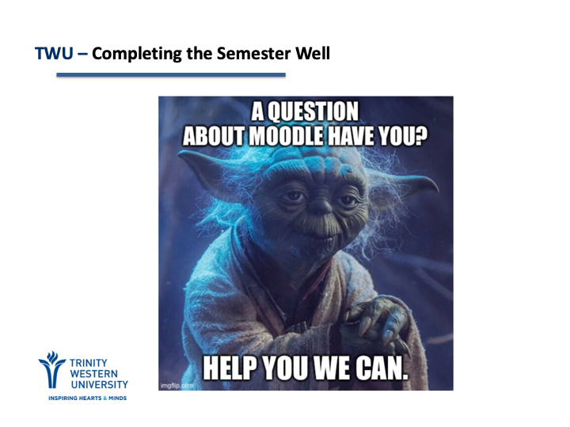
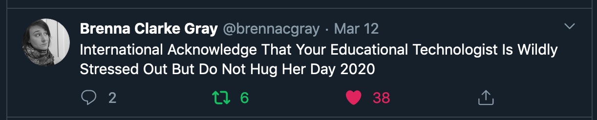

# Moving Online

### Foundations

---

---

---

---
# YOU are the best technology!

---
# Pick 2

---

#### Tools
- Moodle  
- Zoom  
- Text  
- Phone  
- Email  
- ...

---

#### Guiding Principles  
- scale back  
- demonstrate care  
- focus on basics  
- be flexible  
- connect  
- ...  

---

#### Big Ideas  
Two things from your course that you want to focus on for the remainder of the course.

---

#### Skills or Dispositions  
Two things you hope learners will be able to do or demonstrate.

---

#### Ways Learners can help you redesign  
You are not alone! The learners in your class can have excellent ideas on how to finish well. Ask them!

---

#### Ways to find the learning moment.  
How is this experience of a global pandemic connected to your course? Dig in!

---

# Moodle

---

#### Have you...
- asked your students?  
- logged in?  
- uploaded a file?  
- sent a message?  
- created a welcome forum?  
- created an assignment dropbox?  
- created a quiz?  
- adjusted your gradebook?  

---

# [learn.twu.ca](https://learn.twu.ca)

---
