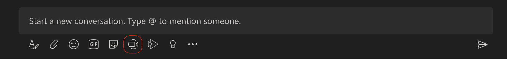

!! See [TWU.ca](https://www.twu.ca) for the latest official information about COVID-19.

### Recorded Support Sessions (Monday and Tuesday, March 16-17)

---

Colin Madland and Scott Macklin discuss the complex and human challenges regarding moving courses online including tips, resources and promising practices using Moodle and Zoom in support of teaching and learning.

<iframe src="https://player.vimeo.com/video/398390578" width="640" height="360" frameborder="0" allow="autoplay; fullscreen" allowfullscreen></iframe>

<a href="https://vimeo.com/398390578">TWU &quot;Moving Online&quot; Jam</a> from <a href="https://vimeo.com/twucourses">Trinity Western Courses</a> on <a href="https://vimeo.com">Vimeo</a>.

---

Laurie Matthias and Nina Lui discuss re-thinking authentic and relevant ways to assess student learning.

<iframe src="https://player.vimeo.com/video/398392036" width="640" height="360" frameborder="0" allow="autoplay; fullscreen" allowfullscreen></iframe>

<a href="https://vimeo.com/398392036">TWU Online Jam Assessment</a> from <a href="https://vimeo.com/twucourses">Trinity Western Courses</a> on <a href="https://vimeo.com">Vimeo</a>.

---

### Scheduled Support for Faculty

!!!! Thank you to everyone who participated in our first cohort of the Teaching ONline Effectively (TOnE) mini-course. We look forward to the second cohort beginning May 19. Watch for more info here and in your inbox.

Our Academic Technology Ambassadors (ATAs), who are all students, have completed their contracts and so we are adjusting how we will provide support through the summer.

#### Access our frequently asked questions page.
We have an extensive and growing list of [self-help tutorials here](https://create.twu.ca/help) and also in the menu bar in Moodle under 'Resources'.

#### Create a ticket
The best way to ensure someone will see your request is to  create a ticket by emailing [elearning@twu.ca](mailto:elearning@twu.ca) or visiting [twu.ca/help](https://twu.ca/help).

#### Join the team in MS Teams
We have created a Team in Microsoft Teams, [please join the team at this link.](https://teams.microsoft.com/l/team/19%3ac4a16207670f47488af233b44bbf601a%40thread.tacv2/conversations?groupId=44141a65-3057-4afb-aa95-a85d566d4bd3&tenantId=2b4ef155-1673-43ef-a480-230c3d483f16) You will be prompted for a code, which is `nee3yxh`.

Once you are in the team, you can use the chat function to send a direct message to Reza by typing `@reza` and choosing 'Reza Khosrowtaj' and then clicking 'Send'.

Alternately, you can click the 'Meet now' button to start a video call.

