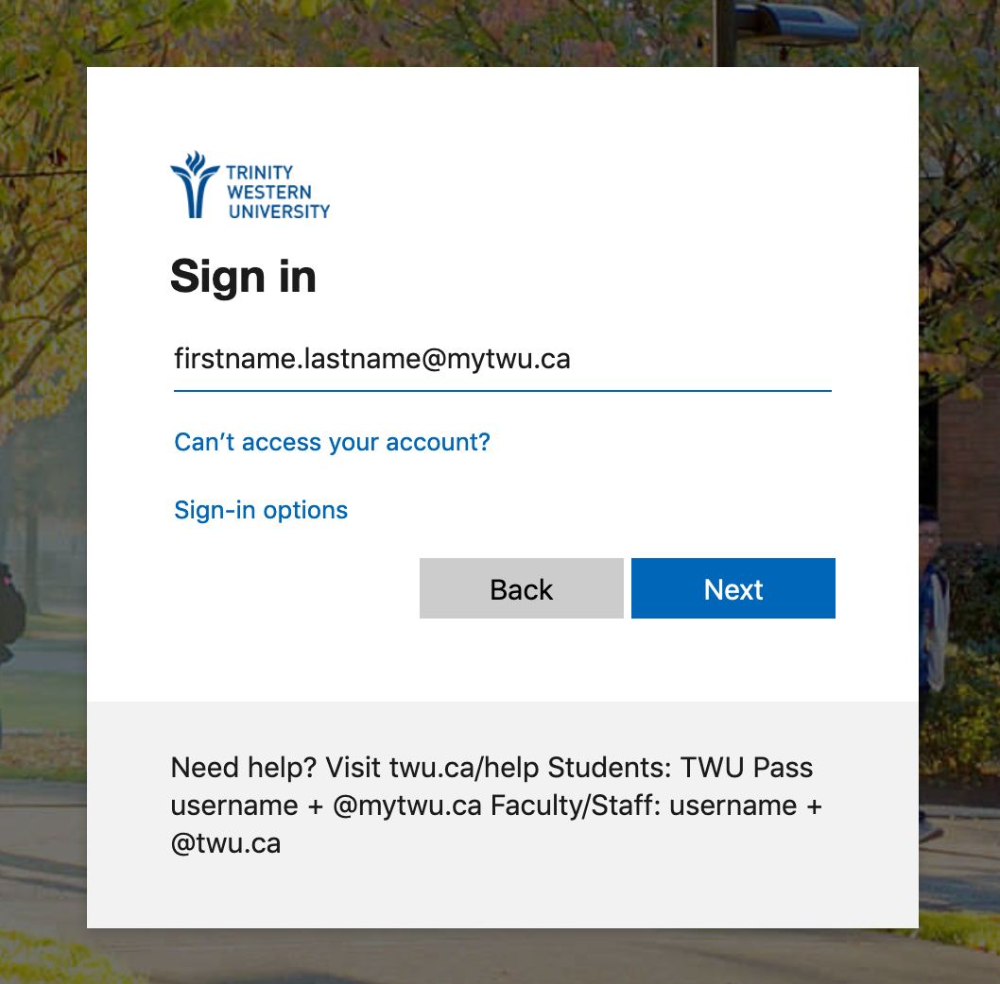

#### About
Moodle is a web platform that allows students and faculty to access a common, secure space to interact in the context of a particular course. Faculty are able to create or upload resources related to the course, distribute information about assignments and supplementary course materials, create and manage quizzes, and host conversations in the forums. Students are able to contact their faculty and each other, submit assignments, respond to discussion prompts, and complete quizzes.

Moodle is one component of TWU's Digital Learning Commons, which also includes [WordPress](https://create.twu.ca), [PressBooks](https://books.twu.ca), and other platforms maintained by individual faculty.

#### Login

Go to [learn.twu.ca](https://learn.twu.ca) and enter your TWU email and password. You may notice that you are signed in automatically if you are already signed in to a different TWU system (Office365).

!!!! Every TWU student, staff, and faculty member has been assigned a ...@mytwu.ca (students) or ...@twu.ca (staff and faculty) email address. In ***most*** cases, your username is `firstname.lastname` and it is identical to the username you use to sign in to TWUPass.
!!!! To sign in to Moodle, your email will be as follows:
!!!! - firstname.lastname@mytwu.ca if you are a student;
!!!! - firstname.lastname@twu.ca if you are staff or faculty.
!!!! If you cannot sign in to Moodle, please contact [the elearning helpdesk at elearning@twu.ca](mailto:elearning@twu.ca).

The first page you see in Moodle will be your `Dashboard` showing all of your current courses.

1. Tap the `Resources` link to access Frequently Asked Questions and other helpful articles.

2. Your current courses should be available under the `In progress` link. If you don't see them there, they may be on a separate page (click the navigation arrows to show more courses), or they may be under the `Future` tab.
3. Tap or click the course title to go to that course.
4. If a course title is greyed out, the course is not visible to students. [Tap or click here for instructions to make your course visible.](https://create.twu.ca/help/moodle/faculty/show-hide).  
