-  Click the link in the invitation or go to [GitHub.com](https://github.com) and fill in the 'Sign-up' details. Keep in mind that you may choose to sign up anonymously if you are concerned about your privacy.
  - You can find more information on the [GitHub Help Pages](https://help.github.com/articles/signing-up-for-a-new-github-account/)
  - Make sure you choose a free plan.
- To complete the sign-up process, you will need to [verify your email address](https://help.github.com/articles/verifying-your-email-address/).

#### Download and install GitHub Desktop

[Go to desktop.github.com](https://desktop.github.com) and follow the download and installation instructions.

#### Click 'Sign in to GitHub.com'

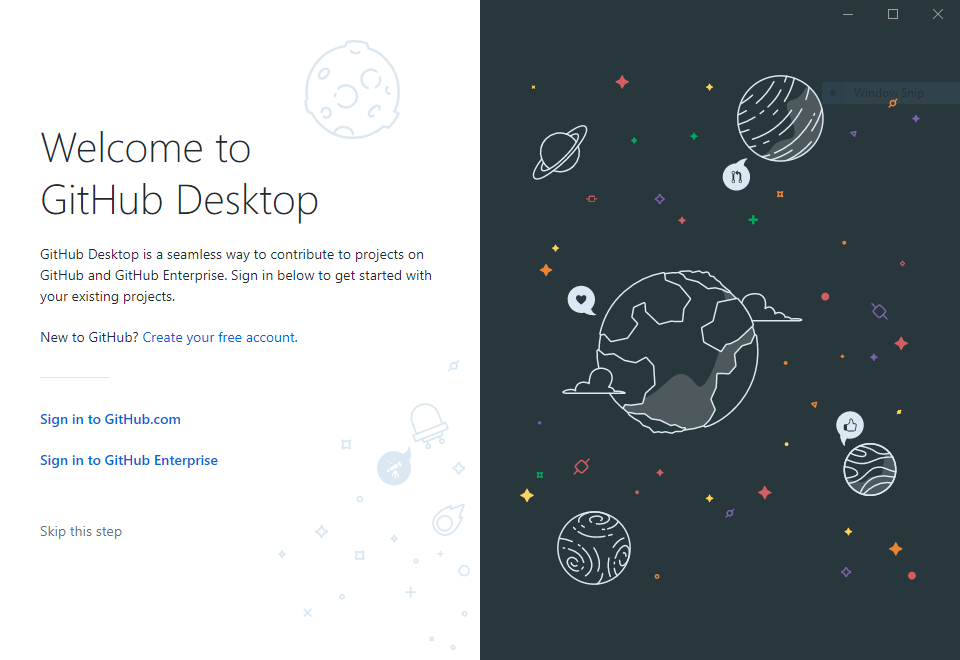

#### Sign in

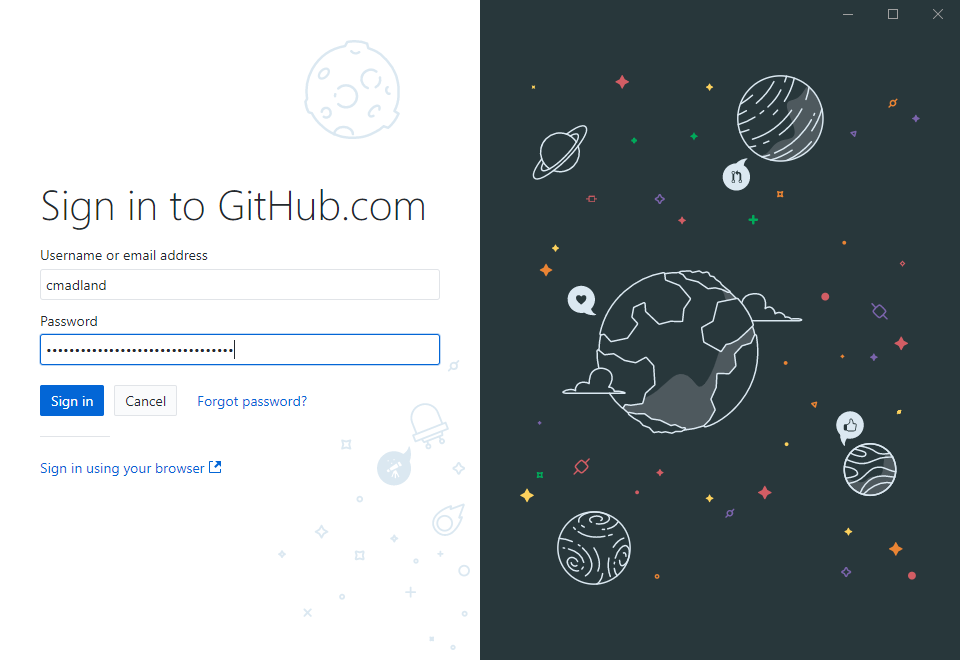

#### Click 'Continue'

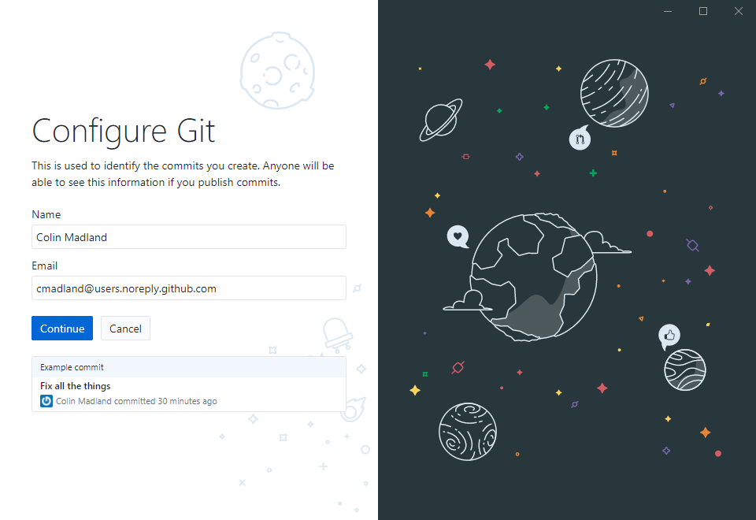

#### Click 'Clone a repository from the internet.'

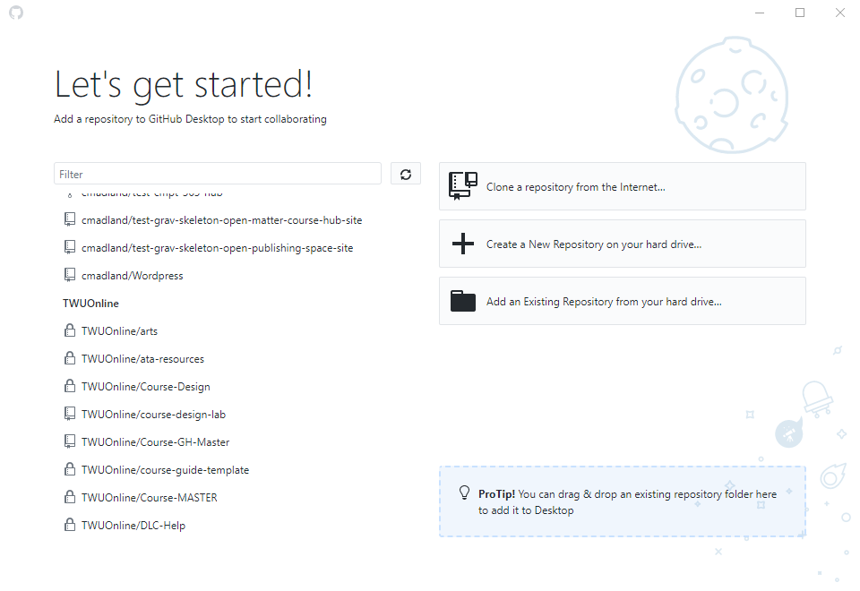

#### Search for the title of your repo and choose it from the list.

#### Click 'Clone'
- make note of the 'Local path' where the folder will be saved.
- we recommend you choose 'Documents' on your PC or Mac.
-
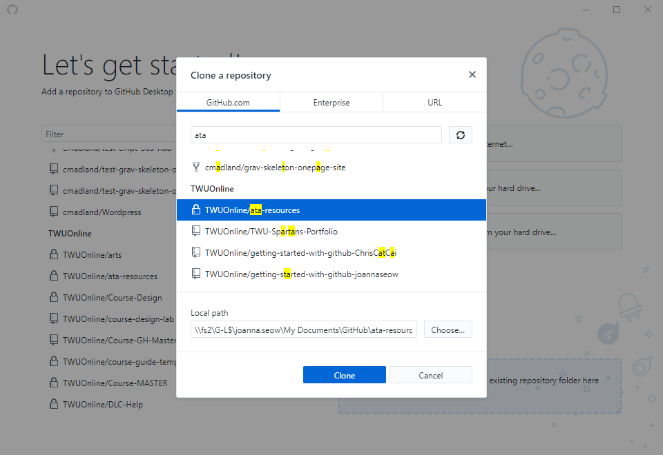

#### Let it do its thing...may take a while.

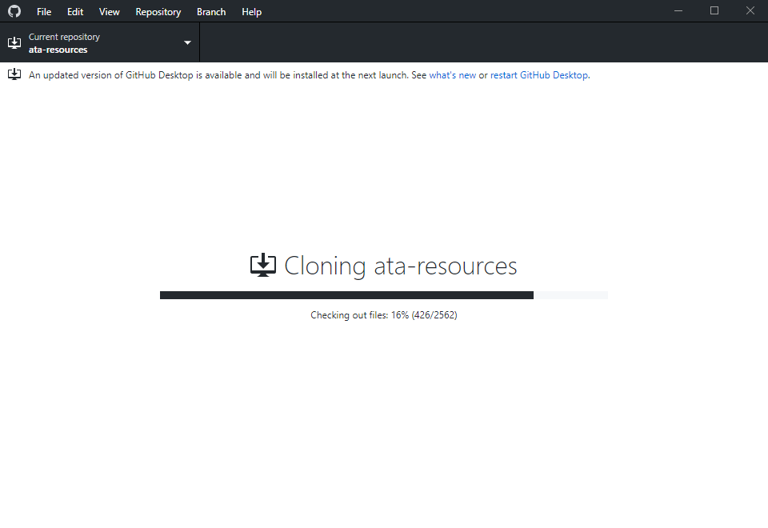

#### Click 'Fetch origin'

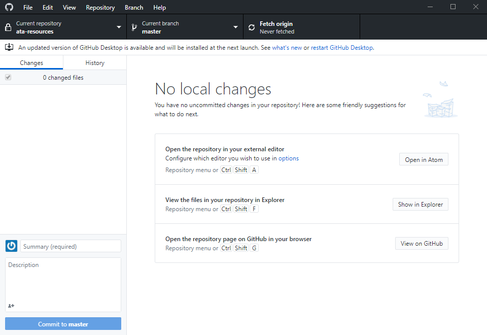

#### If you want to add another repo, go to 'File > Clone repository'

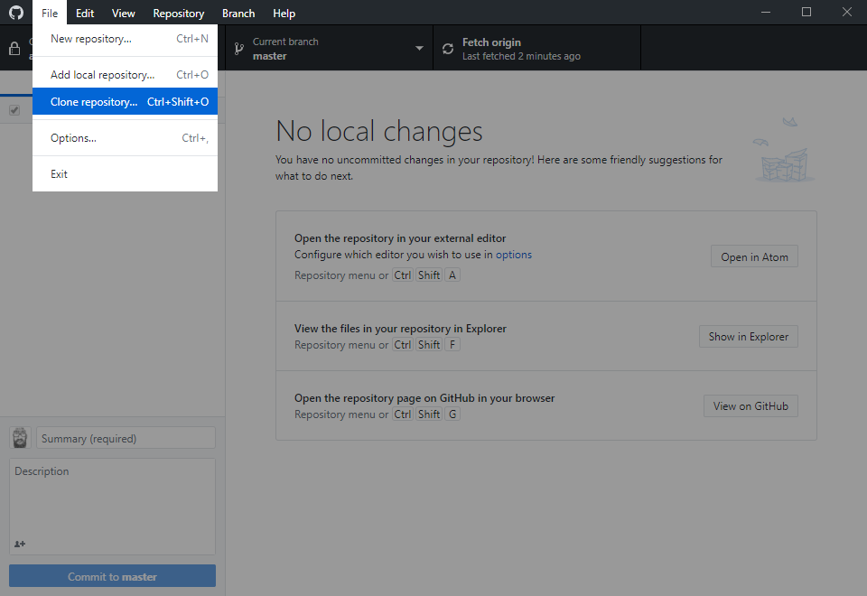

## Atom

#### Download Atom

Go to [atom.io](https://atom.io) and follow the download and installation instructions.

#### Once it is installed, click 'Open a Project'

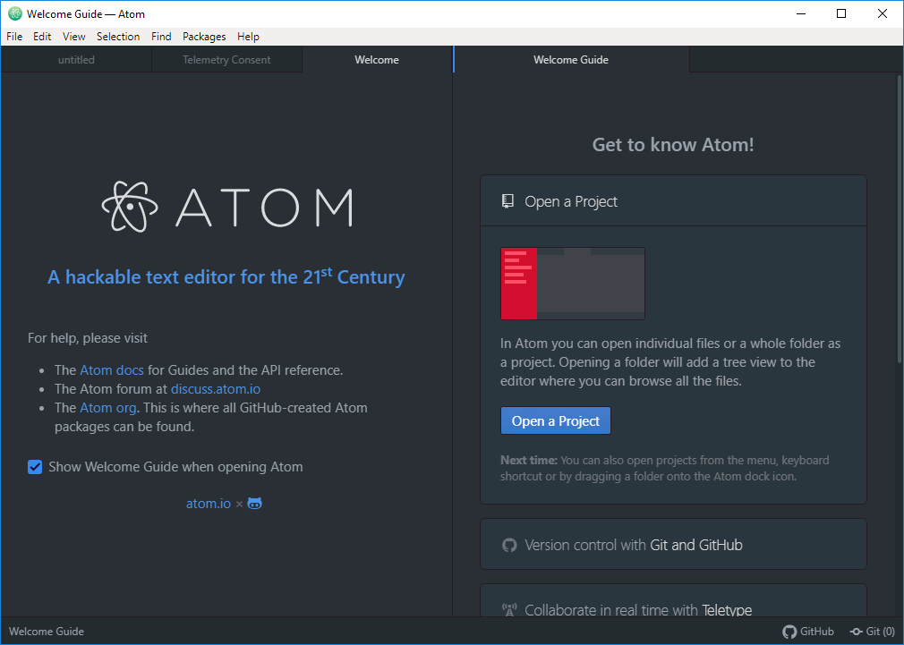

#### Go to 'Documents > GitHub > [your-repo-title]'

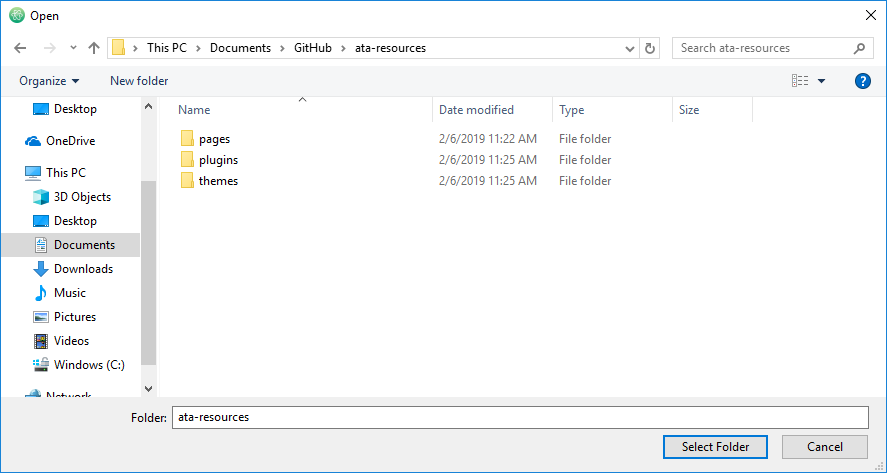

#### The files will appear in the left side 'Project' column

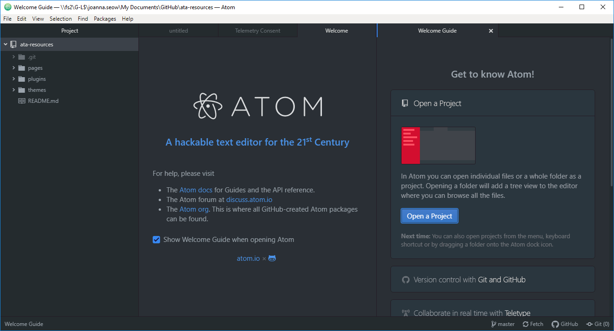

#### To create a new page in Grav, right-click a previous page and click 'Duplicate'.

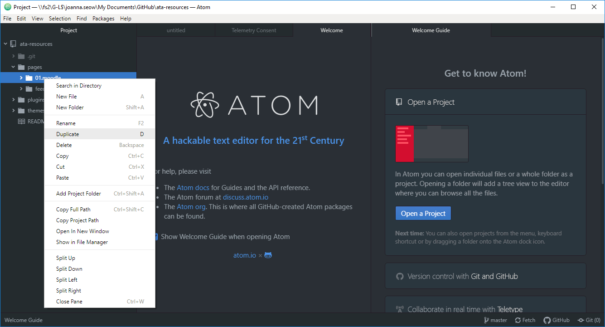

#### Give the folder a new number (if it's there) and name.

#### Watch *GitHub for Poets 1.1*

[plugin:youtube](https://youtu.be/BCQHnlnPusY)
